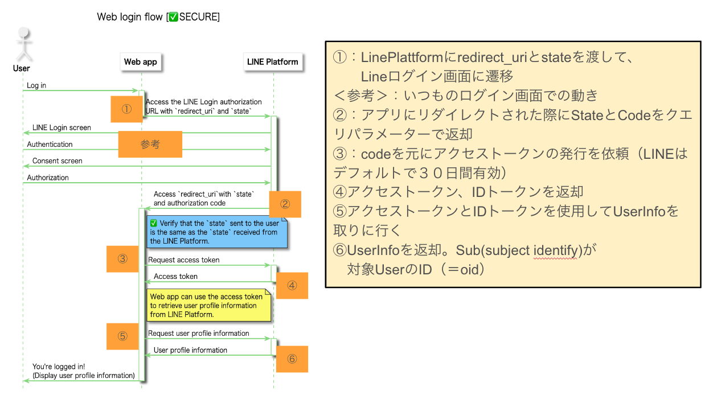
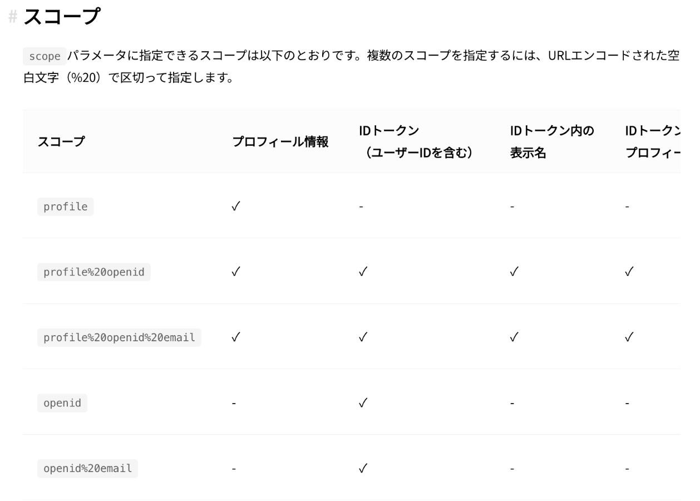

# ソーシャルログイン　LINE編

<details open="open">
<summary>目次</summary>

- [事前準備](#事前準備)
- [ログインの流れ](#ログインの流れ)
  - [①LINEログイン画面にアクセス](#①LINEログイン画面にアクセス)
  - [②アプリにstateとcodeを返却](#②アプリにstateとcodeを返却)
  - [③アクセスToken発行を依頼](#③アクセスToken発行を依頼)
  - [④アクセストークン、IDトークンなどを返却](#④アクセストークン、IDトークンなどを返却)
  - [⑤アクセストークンを使用してUserInfoを取得依頼](#⑤アクセストークンを使用してUserInfoを取得依頼)
  - [⑥UserInfoのsub(Subject Identifier)がユーザー固有のID](#⑥UserInfoのsub(Subject Identifier)がユーザー固有のID)
  - [ログアウト、IDトークンの検証](#ログアウト、IDトークンの検証)


- [参考](#参考)

</details>

# 事前準備

- LINE Developersにサインイン
- アプリで使用するチャネルを作成
- チャネルID、チャネルシークレットはAPI叩く際に必要。環境変数化する
- LINEログイン設定で、２要素認証の必須かにチェック＆コールバックURLを登録

# ログインの流れ
- 下記がLineログインの概要図



### ①LINEログイン画面にアクセス

- 下記のコードのようにアクセス

```tsx
export const Login = () => {
    
    const loginClick = () => {
        const lineId = import.meta.env.VITE_LINE_CHANNEL_ID
        const redirecturl = import.meta.env.VITE_REDIRECT_URL
        const url = `https://access.line.me/oauth2/v2.1/authorize?response_type=code&client_id=${lineId}&redirect_uri=${redirecturl}&state=12345abcde&scope=openid&nonce=09876xyz`
        window.location.href = url;
    }
    
    return <>
        <button
            onClick={loginClick}
        >
           LINEでログイン
        </button>
    </>
}    
```
- 下記が各クエリパラメータの説明
- response_type : code
- client_id : チャネルid
- redirect_uri : コールバック時の遷移先登録
- state : ログインセッションごとにWebAppでランダムに生成すること
- scope : ユーザーに付与する権限（詳細は下記。最小限はopenidで良い）
- [prompt] : consent。強制的に同意画面を表示
- [max_age] : ユーザー認証後に許容される最大経過時間(秒)



### ②アプリにstateとcodeを返却
- stateとcodeがクエリパラメータでアプリに返却される(コールバックで指定したリダイレクURLに)
- クエリパラメータのcodeを使用するので、下記の様にして、取り出しが可能
```tsx
const searchParams = new URLSearchParams(location.search);
const code = searchParams.get('code')
```

### ③アクセスToken発行を依頼
- リダイレクトされた際のcodeを使用してAccessトークンの発行を依頼
```ts
export const accessTokenGetRepository = async (code:string) => {
  const data = {
    grant_type: 'authorization_code',
    code: code,
    client_id: import.meta.env.VITE_LINE_CHANNEL_ID, // チャネルID
    client_secret: import.meta.env.VITE_CLIENT_SECRET, // チャネルシークレット
    redirect_uri: import.meta.env.VITE_REDIRECT_URL, // 「LINEログイン設定」で設定したコールバックURL
  };
  try {
    return await axios.post(
            'https://api.line.me/oauth2/v2.1/token',
            data,
            {
              headers: {
                'content-type': 'application/x-www-form-urlencoded',
              },
            },
    );
  } catch (err) {
    console.log('accessTokenGetRepositoryのエラーです : ',err)
  }
}
```

### ④アクセストークン、IDトークンなどを返却
- responseの中にアクセストークンや、IDトークンなどを含む下記データが返却される
```json
{
  "access_token": "bNl4YEFPI/hjFWhTqexp4MuEw5YPs...",
  "expires_in": 2592000,
  "id_token": "eyJhbGciOiJIUzI1NiJ9...",
  "refresh_token": "Aa1FdeggRhTnPNNpxr8p",
  "scope": "profile",
  "token_type": "Bearer"
}
```

### ⑤アクセストークンを使用してUserInfoを取得依頼
- 下記の様に、アクセストークンを使用
```ts
export const getUserIdRepository = async (accessToken:string) => {
  try {
    const response = await axios.get('https://api.line.me/oauth2/v2.1/userinfo', {
      headers: {
        'Authorization': 'Bearer ' + accessToken,
      },
    });
    return response.data
  } catch (error) {
    console.log("error : ",error)
  }
}
```

### ⑥UserInfoのsub(Subject Identifier)がユーザー固有のID
- 同じIdP内では一意のIDだが、プロバイダーをまたぐと一意とは限らない。issなどのトークン発行元のドメインも一緒に保存すると良い
```json
{
  "sub": "U1234567890abcdef1234567890abcdef",
  "name": "Taro Line",
  "picture": "https://profile.line-scdn.net/0h8pWWElvzZ19qLk3ywQYYCFZraTIdAGEXEhx9ak56MDxDHiUIVEEsPBspMG1EGSEPAk4uP01t0m5G"
}
```


### ログアウト、IDトークンの検証

- ログアウトしたい場合は下記
```ts
export const logoutRepository = async (accessToken: string | null) => {
  const data = {
    access_token:accessToken!,
    client_id: import.meta.env.VITE_LINE_CHANNEL_ID, // チャネルID
    client_secret: import.meta.env.VITE_CLIENT_SECRET, // チャネルシークレット
  };
  try {
    return axios.post(
            'https://api.line.me/oauth2/v2.1/revoke',
            data,
            {
              headers: {
                'content-type': 'application/x-www-form-urlencoded',
              },
            },
    );
  } catch (err) {
    console.log('accessTokenGetRepositoryのエラーです : ',err)
  }
}
```

- IDトークンの検証をして、issを取得したい場合は下記
```ts
export const checkIDTokenRepository = async () => {
  const data = {
    id_token:localStorage.getItem('id_token'),
    client_id: import.meta.env.VITE_LINE_CHANNEL_ID, // チャネルID
  };
  try {
    return axios.post(
            'https://api.line.me/oauth2/v2.1/verify',
            data,
            {
              headers: {
                'content-type': 'application/x-www-form-urlencoded',
              },
            },
    );
  } catch (err) {
    console.log('accessTokenGetRepositoryのエラーです : ',err)
  }
}
```


# 参考
- [参考Quitta](https://qiita.com/raisack8/items/9336e815dacfa6a37a9e#0-%E3%83%81%E3%83%A3%E3%83%8D%E3%83%ABid%E5%8F%96%E5%BE%97%E6%96%B9%E6%B3%95)
- [LINE DEVELOPERS 公式ドキュメント](https://developers.line.biz/ja/reference/line-login/)
- [LINEボタンのルール](https://developers.line.biz/ja/docs/line-login/login-button/)
- 
